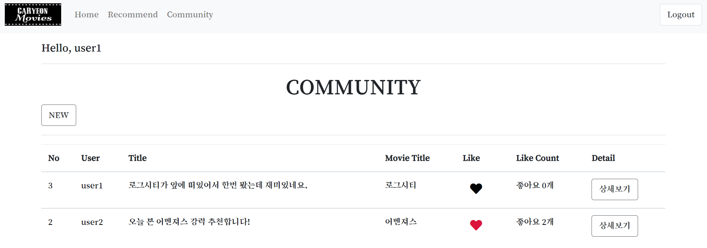

[TOC]

README

# 🎬영화 추천 사이트: GaRyeon MOVIES

> 팀명: '대련'과 영화볼'가영'
>
> 팀원: 이대련, 신가영(팀장)


## 1. 목표 서비스 및 사용 기술

### 1-1. 목표

- 영화 정보 기반 추천 서비스 구성
- API를 사용하여 데이터를 수집하고 서비스 제공
  - TMDB API
- 영화 관련 대화를 할 수 있는 커뮤니티 서비스 제공
- HTML, CSS, JavaScript, Django, DataBase 등을 활용한 서비스 설계
- 평점순, 인기순, 장르별 추천 알고리즘 생성
- 서비스 관리 및 유지보수


### 1-2. 사용 기술

- Python 3.7.7

- Django 3.1.3 & Vanila JS
- HTML, CSS, Bootstrap, JavaScript


## 2. 역할 분담 및 전체 일정

### 2-1. 역할분담

**공통**

- 영화 추천 사이트 서비스 구성
- 전체 로직 구상 및 구현
- 영화 추천 알고리즘 구현

=> 전체적으로 협업하고 세부 내용 분업


**이대련**

- PPT 발표
- Form 디자인 수정
- Community, Account CRUD 구현
- API, JSON 파일 생성 및 데이터 불러오기
- 인기순, 평점순 추천 알고리즘 구현
- ERD 모델링


**신가영**

- 일정 관리
- 디자인 및 스타일링
- Community, 평점 CRUD 구현
- 장르별 추천 알고리즘 구현
- PPT 제작


### 2-2. 전체 일정 (trello)


## 3. ERD 모델링


## 4. 주요 기능 및 추천 알고리즘

### 4-1. 주요기능

- 영화 장르 데이터와 정보 데이터와를 The Movie Database(TMDB)에서 수집하는 과정이다.


- M:N관계가 가능하도록 형식에 맞추어 영화 장르 데이터와 정보데이터가 들어간 json파일 생성한다.  이후 loaddata를 통해 database에 등록한다.


**영화 정보를 가져온 홈페이지**

- 실제로 데이터를 가져온 영화들을 홈페이지에 보여주고 영화 포스터 및 detail 버튼 클릭시 영화 정보 페이지로 넘어가게 된다
- 전체적인 디자인은 흰색 바탕화면에 폰트를 새로 설정하였고, 카드 형식으로 영화들을 나타내었다.
- 로그인이 되었을 때, Logout버튼과 이름이 나타나게하며 로그아웃되면 다시 회원가입, 로그인이 보이게 한다.
- 영화 추천페이지, 영화 커뮤니티 페이지로 갈 수 있는 상단바가 존재한다.


**영화 정보 확인 및 평점 등록 페이지**

- 영화 정보페이지에서는 평점과 리뷰를 남길 수 있고 가져온 영화 정보데이터에서 개봉일, 평점, 줄거리를 나타내었다.
- 로그인 된 사람만 평점을 등록할 수 있으며, 평점 삭제는 해당 평점을 등록했던 유저만 가능하다.
- 디자인은 bootstrap4를 이용해 form을 좀 더 예쁘게 바꾸었다.


**영화 커뮤니티 페이지**

- 상단바를 통해 영화 커뮤니티로 이동하면, 영화와 관련 된 대화를 할 수 있는 커뮤니티를 확인 할 수 있다.
- 로그인이 안되어 있을 때는, NEW대신에 "※ 새 글을 작성하려면 로그인하세요" 라는 문구가 뜨고 Detail항목이 없기 때문에 글을 조회할 수 없다.
- Like 좋아요 버튼은 Ajax를 활용한 비동기 요청을 통해 사용자 경험을 향상시켰다.
- 표를 활용해 보다 간단하고 보기 편하게 만들었다.




- Detail 페이지로 들어가보면 작성자 본인만 글을 수정/ 삭제 할 수 있으며, 댓글 작성자 본인만 댓글을 삭제할 수 있다.
- 각 게시글에는 생성 및 수정 시각 정보가 포함되어 있다.


**관리자뷰**

- 관리자는 장고에서 기본적으로 제공되는 admin 기능을 이용하여 구현한다.
- 관리자 권한의 유저만 영화 등록/ 수정/ 삭제 권한,  유저 관리 권한을 가진다.


### 4-2. 추천 알고리즘

- 인기순, 평점순, 장르별 추천 방식이 있고 로그인 된 사용자에게 추천을 한다.
- 장르별 추천 방식의 경우에는 실제 장르값이 주어졌을 때, 그 장르값을 갖고 있는 영화들을 가져와 새로운 배열에 key : value 값 형식의 JsonResponse를 Return해준다.
- html에서는 event발생시 axios 요청을 통해서 가져온 데이터를 지정한 ul태그 안에다 반복문을 활용하여 영화 타이틀 텍스트를 표시해주었다.


**인기순 추천**

- 인기가 높은 것부터 차례로 사용자에게 추천을 해줍니다. 영화 제목 밑에 popularity를 보여줍니다.


**평점순 추천**

- 평점이 높은 것 부터 차례로 사용자에게 추천을 해줍니다. 영화 제목 밑에 vote_average을 보여줍니다.


**장르별 추천**

- 장르별로 사용자에게 추천을 합니다. 옵션에서 장르를 선택시 해당 영화의 제목이 출력됩니다.


## 5. 느낀점 및 문제 해결 과정

### 5-1. 느낀점

**신가영**

```
종합 PJT를 하면서 지금까지 배웠던 모든 과정을 전체적으로 복습하는 느낌이 들었다. 이번 프로젝트를 통해 내가 제대로 이해하지 못하고 있었던 부분을 보충 학습할 수 있었고, 잘 안되던 부분을 디버깅해서 원하던 기능을 구현했을 때에는 뭔가 해냈다는 느낌과 함께 성취감도 느낄 수 있었다. 추천 알고리즘은 어려웠지만 프로젝트를 실제 사이트같이 구현하기 위해 필수적인 기능이라도 느꼈다. 이번에 특히 재미있다라고 생각한 건 bootstrap을 이용한 디자인이었다. 직접 로고를 만들어 이미지를 넣기도하고, 사이트처럼 만들기 위해 스타일링하는 작업이 재밌었다. 항상 생각하지만 페어 프로젝트를 하면서 협업을 하면 혼자하는 것보다 완성도나 퀄리티가 높아지는 것 같다. 가끔씩 분업을 하기도 했는데 분업은 시간이 절약된다는 점이 좋았다. 1학기 마지막 프로젝트를 잘 맞는 페어와 함께 원하는 사이트를 만들 게 되어서 뿌듯하다.
```

**이대련**

```
처음 프로젝트를 구상할 때 youtube 강사님이 "자동차를 만들기위해 바퀴/엔진을 따로 만드는 것이 아닌, 굴러가는 킥보드/ 자전거/ 오토바이/ 자동차 순서로 만들어 봐라" 라고 해주신 말씀을 따랐더니 이렇게 프로젝트를 잘 완성할 수 있게 된 것 같다. 종합 프로젝트를 하면서 기존에 우리가 배웠던 것들을 토대로 전체를 구현도 하였고 추가적인 추천 알고리즘과 bootstrap을 작성하고 사용해보았다. 이를 통해 복습과 새로운 기능, 구현에 대한 학습도 할 수 있었고 또한 페어와의 협업을 하면서 정말 좋은 페어를 만났다는 것도 느꼈고 협업에 대한 좋은 경험과 기억도 많이 얻게 되었다. 
```


### 5-2. 문제 해결 과정

- 장르별 추천 알고리즘이 해당하는 장르의 영화 데이터 제목을 li 태그를 생성해 ul 태그 안에 넣는 방식인데,  새로운 장르 옵션을 선택시 기존 텍스트가 지워지지 않은 채 그 이후에 추가되는 현상이 발생.
  - 데이터 삽입전에 데이터를 지우려고 remove, empty 등 다양한 방법을 처음에 사용해 보았으나 remove 같은 경우에는 태그 자체를 삭제해버림.
  - `ul.innerHTML =''`  을 사용하여 문제를 해결 하였고, 새로운 장르 옵션 선택 반복시 그 옵션에 해당하는 영화 제목만 나오게 됨.

- 장르별 추천 알고리즘을 구현해 놓고, 나중에 홈페이지를 꾸미면서 base.html의 상단바를 만들면서 생긴 ul 태그에 먼저 넣어버리는 상황이 발생.
  - 우리가 원하는 ul 태그에 class 를 부여해 특정 ul 태그안에 영화 데이터 제목을 넣을 수 있게 함


